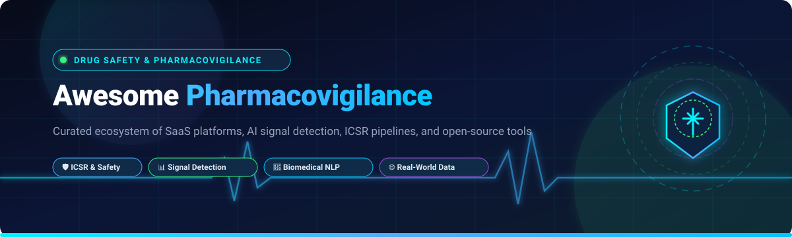

<p align="center">
  
</p>

# 🔬 Awesome-Pharmacovigilance 💊

<p align="center">
  <a href="https://github.com/ishandutta2007/Awesome-Awesome-Awesome"></a>
  <a href="https://discord.gg/jc4xtF58Ve"></a>
  <a href="https://github.com/ishandutta2007/Awesome-Pharmacovigilance/stargazers"></a>
  <a href="https://github.com/ishandutta2007/Awesome-Pharmacovigilance/network/members"></a>
  <a href="https://github.com/ishandutta2007/Awesome-Pharmacovigilance/blob/main/LICENSE"></a>
  <a href="https://github.com/ishandutta2007/Awesome-Pharmacovigilance/pulls"></a>
  <a href="https://github.com/ishandutta2007"></a>
</p>

---

## 🌟 Top Pharmacovigilance & Drug Safety Ecosystem

> **A curated collection of enterprise SaaS platforms, AI-driven signal detection tools, open-source repositories, adverse event databases, and biomedical NLP pipelines for Pharmacovigilance (PV), Individual Case Safety Reporting (ICSR), and Regulatory Compliance.**

**Last updated: August 2026**

Pharmacovigilance (PV) and Drug Safety systems enable pharmaceutical enterprises, biotechnology sponsors, Clinical Research Organizations (CROs), and regulatory agencies to collect, monitor, assess, triage, analyze, and report adverse drug reactions (ADRs) and Individual Case Safety Reports (ICSRs). These technologies ensure compliance with global regulatory bodies (FDA, EMA, PMDA, MHRA, WHO) across E2B(R3) transmission, aggregate reporting (PSUR/PBRER/DSUR), MedDRA coding, literature screening, signal management, and safety intelligence.

---

## 📑 Table of Contents

- [🏢 SaaS & Hosted Enterprise Platforms](#-saashosted-enterprise-platforms)
- [💻 Open-Source GitHub Projects](#-open-source-github-projects)
- [🛠️ Research Architecture & Toolkits](#️-research-architecture--toolkits)
- [📈 Star History](#-star-history)
- [🤝 How to Contribute](#-how-to-contribute)
- [⚠️ Disclaimer](#️-disclaimer)

---

## 🏢 SaaS/Hosted Enterprise Platforms

The table below catalogs leading commercial pharmacovigilance, drug safety, and quality management suites. **Sorted descending by company size (Revenue / Market Capitalization / Valuation)**.

| Product | Company Scale (Revenue / Valuation) | Focus & Capabilities | Starting Pricing | Free Tier / Free Trial Limits | Official Link |
| :--- | :--- | :--- | :--- | :--- | :--- |
| **Oracle Argus Safety (Safety One Argus)** | ~$57.4B Revenue / ~$409B Market Cap | Comprehensive enterprise safety case management, automated intake, global regulatory reporting (E2B(R3)), and multi-tenant safety analytics. | ~$100,000 / year base enterprise subscription (~$899/month for dedicated sandbox/training instances) | 30-day evaluation trial via Oracle Cloud Free Tier ($300 cloud credits + guided demo); no permanent free plan | [Oracle Argus](https://www.oracle.com/life-sciences/safety/) |
| **Oracle Life Sciences Empirica** | ~$57.4B Revenue / ~$409B Market Cap | Enterprise safety signal detection, statistical data mining, and pharmacovigilance analytics across spontaneous reporting databases (FAERS, VAERS, VigiBase). | ~$50,000 / year base signal management subscription | 30-day evaluation trial with sample signal detection datasets; no permanent free plan | [Oracle Empirica](https://www.oracle.com/life-sciences/pharmacovigilance/) |
| **Sparta Systems (TrackWise Digital Safety)** | ~$37.4B Revenue (Honeywell) / ~$77B Market Cap | Cloud-based quality, complaint handling, product surveillance, and adverse event reporting integrated with CAPA management. | ~$200 / user / month (~$20,000 / year entry SMB deployment) | 14-day interactive sandbox trial with pre-configured workflows; no permanent free plan | [Sparta Systems](https://www.spartasystems.com/) |
| **IQVIA Vigilance Platform** | ~$16.3B Revenue / ~$40B Market Cap | AI-powered global pharmacovigilance ecosystem combining adverse event intake, medical literature surveillance, safety analytics, and regulatory submissions. | ~$75,000 / year base platform tier | 30-day proof-of-concept sandbox trial with sample FAERS/EudraVigilance datasets; no permanent free plan | [IQVIA Vigilance](https://www.iqvia.com/solutions/technologies/safety-and-regulatory) |
| **Veeva Vault Safety** | ~$3.2B Revenue / ~$35B Market Cap | Cloud-native pharmacovigilance application for adverse event intake, processing, and multi-agency electronic submission unified with Veeva Clinical & Regulatory suites. | ~$25,000 / year platform base fee + $500–$2,400 / user / year | **Free tier via Veeva SiteVault** (free for research sites up to 20 active studies); 30-day sandbox POC for Vault Safety | [Veeva Safety](https://www.veeva.com/products/vault-safety/) |
| **ArisGlobal LifeSphere Safety** | ~$1.2B Valuation / ~$150M+ Revenue | End-to-end cloud pharmacovigilance engine featuring cognitive case processing, automated ICSR intake, and global safety reporting. | ~$50,000 / year entry platform contract (~$1,200 / user / year) | 14-day guided proof-of-concept sandbox trial with pre-loaded demo datasets; no permanent free plan | [ArisGlobal](https://www.arisglobal.com/lifesphere/safety/) |
| **ArisGlobal LifeSphere Advanced Intake** | ~$1.2B Valuation / ~$150M+ Revenue | Optical Character Recognition (OCR) and NLP intake engine automating adverse event extraction from spontaneous emails, forms, and clinical reports. | ~$25,000 / year automated intake add-on tier | 14-day POC sandbox trial with document processing limit (up to 50 sample documents); no permanent free plan | [LifeSphere Intake](https://www.arisglobal.com/lifesphere/safety/) |
| **ArisGlobal LifeSphere Advanced Signals** | ~$1.2B Valuation / ~$150M+ Revenue | Automated signal management, risk evaluation, and disproportionality analytics engine leveraging multi-source real-world data. | ~$35,000 / year signal analytics tier | 14-day interactive trial on pre-loaded signal datasets; no permanent free plan | [LifeSphere Signals](https://www.arisglobal.com/lifesphere/safety/) |
| **ArisGlobal LifeSphere Literature Intelligence** | ~$1.2B Valuation / ~$150M+ Revenue | Intelligent literature surveillance system utilizing AI/NLP to screen biomedical articles for adverse events and drug safety signals. | ~$20,000 / year literature monitoring AI tier | 14-day trial with surveillance cap of up to 5 journal feeds / target search queries; no permanent free plan | [LifeSphere Literature](https://www.arisglobal.com/lifesphere/safety/) |
| **Ennov Vigilance** | ~$50M Revenue | All-in-one pharmacovigilance suite supporting ICSR case intake, MedDRA coding, regulatory submissions (E2B), and compliance audit trails. | ~$18,000 / year (or ~$1,500 / user / month entry SaaS tier) | 14-day guided proof-of-concept sandbox access on qualification; no permanent free plan | [Ennov Vigilance](https://www.ennov.com/solutions/pharmacovigilance/) |
| **Ennov PV-Works (PVWorks)** | ~$50M Revenue | Established pharmacovigilance database software for adverse event reporting, workflow orchestration, aggregate reporting, and risk management. | ~$24,000 / year entry package for mid-tier deployments | 14-day guided evaluation sandbox with standard ICSR workflows; no permanent free plan | [Ennov PV-Works](https://www.ennov.com/) |
| **EXTEDO (EXTEDOpulse / Safety)** | ~$25M Revenue | Regulatory Information Management (RIM) and pharmacovigilance platform managing electronic ICSR submissions and eCTD compliance. | ~$15,000 / year (~€1,200 / month) entry cloud subscription | 30-day pilot trial environment with limited validation datasets; no permanent free plan | [EXTEDO](https://www.extedo.com/) |
| **RxLogix PV Suite** | ~$20M Revenue | Pharmacovigilance analytics, aggregate safety reporting (PSUR/PBRER), signal detection, and "Safety-in-a-Box" automated case processing. | ~$35,000 / year ("Safety-in-a-Box" flat annual entry package) | 30-day proof-of-value sandbox trial with mock signal detection data; no permanent free plan | [RxLogix](https://www.rxlogix.com/) |
| **Sarjen PV** | ~$15M Revenue | Modular pharmacovigilance system covering adverse event logging, medical review, compliance monitoring, and automated XML reporting. | ~$10,000 / year base pharmacovigilance operations package | 14-day guided trial environment for qualified pharma/CRO teams; no permanent free plan | [Sarjen PV](https://www.sarjen.com/) |
| **PvEdge (Sarjen)** | ~$15M Revenue | Drug safety and adverse drug reaction reporting database built for fast deployment across pharmaceutical companies and CROs. | ~$12,000 / year starting subscription for entry CRO/pharma setups | 14-day test instance access with sample case intake workflows; no permanent free plan | [PvEdge](https://www.sarjen.com/) |
| **AB Cube Platform** | ~$12M Revenue | Multi-vigilance cloud solution encompassing pharmacovigilance, cosmetovigilance, veterinary vigilance, and medical device vigilance. | ~$15,000 / year entry multi-vigilance SaaS tier | 14-day interactive sandbox access with standard vigilance templates; no permanent free plan | [AB Cube](https://www.abcube.com/) |
| **SafetyEasy PV (AB Cube)** | ~$12M Revenue | Standardized pharmacovigilance database compliant with EMA, FDA, and PMDA E2B(R3) standards with automated electronic gateways. | ~$12,000 / year (~€1,000 / month) for small biotech safety portfolios | 14-day full-feature interactive test environment with sample dataset; no permanent free plan | [SafetyEasy PV](https://www.safetyeasy.com/) |
| **Flex Databases (PV Module)** | ~$10M Revenue | Configurable eClinical and pharmacovigilance management software offering audit-ready adverse event tracking and reporting for CROs. | ~$12,000 / year (~$1,000 / month) for small clinical / PV teams | 14-day trial environment access following introductory demo; no permanent free plan | [Flex Databases](https://www.flexdatabases.com/) |
| **Pharmapod** | ~$8M Revenue / Acquired ~$15M | Medication incident management and safety reporting platform designed to eliminate medication errors and facilitate continuous quality improvement. | $150 / year (Safety Assessment tier; $320/yr Essentials, $453/yr Professional) | 14-day trial access following 1-on-1 scheduled demo session; no permanent free plan | [Pharmapod](https://www.pharmapodhq.com/) |
| **Clinevo Safety** | ~$5M Revenue | Modern cloud safety database enabling automated case processing, E2B(R3) XML generation, and drug safety compliance workflows. | ~$9,600 / year (~$800 / month) for core safety database & intake | 14-day full-feature cloud sandbox trial + free setup consultation; no permanent free plan | [Clinevo](https://www.clinevo.com/) |
| **Drug Safety Solutions** | ~$3M Revenue | Hosted drug safety software and managed services providing adverse event intake, case review, and regulatory reporting for emerging biopharma. | ~$8,000 / year entry hosted PV compliance package | 14-day guided feasibility test environment; no permanent free plan | [Drug Safety Solutions](https://www.drugsafetysolutions.com/) |

---

## 💻 Open-Source GitHub Projects

Open-source drug safety software, biomedical NLP libraries, adverse event databases, and observational health data analytics frameworks. **Sorted descending by repository star count**.

1. **[huggingface/transformers](https://github.com/huggingface/transformers)** [](https://github.com/huggingface/transformers/stargazers)  
   State-of-the-art Natural Language Processing library providing pre-trained transformer architectures (BERT, RoBERTa, DeBERTa, BioLinkBERT) widely fine-tuned for adverse drug reaction (ADR) detection, entity extraction, and biomedical relation classification.

2. **[apache/spark](https://github.com/apache/spark)** [](https://github.com/apache/spark/stargazers)  
   Unified analytics and distributed computation engine essential for processing petabyte-scale Real-World Evidence (RWE), electronic health records (EHR), insurance claims, and spontaneous reporting repositories (FAERS, VAERS).

3. **[apache/airflow](https://github.com/apache/airflow)** [](https://github.com/apache/airflow/stargazers)  
   Programmatic workflow orchestration platform commonly utilized to automate end-to-end pharmacovigilance ETL pipelines, scheduled literature scraping, signal calculation batch jobs, and terminology synchronization.

4. **[duckdb/duckdb](https://github.com/duckdb/duckdb)** [](https://github.com/duckdb/duckdb/stargazers)  
   High-performance in-process SQL OLAP database system optimized for zero-copy vectorized querying of massive Parquet, CSV, and tabular pharmacovigilance research datasets.

5. **[postgres/postgres](https://github.com/postgres/postgres)** [](https://github.com/postgres/postgres/stargazers)  
   The world's most advanced open-source relational database, serving as the standard underlying repository for OMOP Common Data Model (CDM) instances and validated audit-trailed safety case databases.

6. **[dmis-lab/biobert](https://github.com/dmis-lab/biobert)** [](https://github.com/dmis-lab/biobert/stargazers)  
   Pre-trained biomedical language representation model trained on large-scale PubMed abstracts and PMC full-text articles for medical Named Entity Recognition (NER), relation extraction, and adverse event classification.

7. **[allenai/scispacy](https://github.com/allenai/scispacy)** [](https://github.com/allenai/scispacy/stargazers)  
   Custom spaCy models and pipelines specialized for biomedical and clinical text processing, scientific entity recognition, abbreviation detection, and UMLS concept linking.

8. **[microsoft/BLENDER (PubMedBERT)](https://github.com/microsoft/BLENDER)** [](https://github.com/microsoft/BLENDER/stargazers)  
   Domain-specific biomedical language model pre-trained from scratch on PubMed abstracts, delivering benchmark-leading performance in biomedical NLP and pharmacovigilance text mining.

9. **[apache/ctakes](https://github.com/apache/ctakes)** [](https://github.com/apache/ctakes/stargazers)  
   Clinical Text Analysis and Knowledge Extraction System (cTAKES) designed for comprehensive information extraction from unstructured electronic medical records and clinical narratives.

10. **[OHDSI/Atlas](https://github.com/OHDSI/Atlas)** [](https://github.com/OHDSI/Atlas/stargazers)  
    Open-source unified web platform for cohort definition, phenotype characterization, incidence rate analysis, and population-level comparative safety effect estimation.

11. **[medspacy/medspacy](https://github.com/medspacy/medspacy)** [](https://github.com/medspacy/medspacy/stargazers)  
    Modular clinical NLP framework extending spaCy for context analysis, clinical section detection, negations/uncertainty handling, and adverse event extraction.

12. **[OHDSI/CommonDataModel](https://github.com/OHDSI/CommonDataModel)** [](https://github.com/OHDSI/CommonDataModel/stargazers)  
    Standardized healthcare data schema (OMOP CDM) enabling reproducible observational drug safety analysis and population-level pharmacovigilance across disparate healthcare systems.

13. **[FDA/openfda](https://github.com/FDA/openfda)** [](https://github.com/FDA/openfda/stargazers)  
    Open data platform and API providing direct programmatic access to FDA datasets including adverse drug events (FAERS), medical device reports (MAUDE), and recall notifications.

14. **[OHDSI/WebAPI](https://github.com/OHDSI/WebAPI)** [](https://github.com/OHDSI/WebAPI/stargazers)  
    RESTful services API layer powering OHDSI analytical applications, vocabulary lookups, cohort generations, and pharmacovigilance execution pipelines.

15. **[OHDSI/CohortMethod](https://github.com/OHDSI/CohortMethod)** [](https://github.com/OHDSI/CohortMethod/stargazers)  
    R package for performing active-comparator new-user cohort studies for population-level drug safety surveillance using propensity scores and Cox proportional hazards regression.

16. **[OHDSI/PatientLevelPrediction](https://github.com/OHDSI/PatientLevelPrediction)** [](https://github.com/OHDSI/PatientLevelPrediction/stargazers)  
    Machine learning framework designed for patient-level predictive modeling of adverse clinical outcomes and treatment risks using observational health data.

17. **[OHDSI/EmpiricalCalibration](https://github.com/OHDSI/EmpiricalCalibration)** [](https://github.com/OHDSI/EmpiricalCalibration/stargazers)  
    Statistical calibration library utilizing negative and positive controls to minimize false-positive safety signals and calibrate p-values in observational safety studies.

18. **[tatonetti-lab/onsides](https://github.com/tatonetti-lab/onsides)** [](https://github.com/tatonetti-lab/onsides/stargazers)  
    Extensive database of adverse drug reactions extracted from structured FDA drug product labels using machine learning and NLP, providing millions of validated drug-ADE pairs.

19. **[KarelDO/BioDEX](https://github.com/KarelDO/BioDEX)** [](https://github.com/KarelDO/BioDEX/stargazers)  
    Large-scale open benchmark and dataset for automated Adverse Drug Event extraction from biomedical papers, linking full-text medical literature directly to standardized ICSR safety reports.

20. **[OHDSI/FeatureExtraction](https://github.com/OHDSI/FeatureExtraction)** [](https://github.com/OHDSI/FeatureExtraction/stargazers)  
    R package for generating patient covariates and feature matrices from OMOP CDM databases to support safety signal detection and predictive analytics.

21. **[mi-erasmusmc/Eunomia](https://github.com/mi-erasmusmc/Eunomia)** [](https://github.com/mi-erasmusmc/Eunomia/stargazers)  
    Synthetic OMOP CDM standard test dataset designed for testing, validating, and developing observational safety research and drug surveillance workflows.

---

## 🛠️ Research Architecture & Toolkits

### 🧱 Building a Self-Hosted Safety Intelligence Stack
A modern research-oriented pharmacovigilance pipeline can be constructed by combining open-source infrastructure:

```
┌───────────────────────────┐      ┌───────────────────────────┐      ┌───────────────────────────┐
│     Safety Data Intake    │      │  NLP & Extraction Layer   │      │ Database & Normalization  │
│ • openFDA (FAERS / VAERS) │ ───► │ • BioDEX & OnSIDES        │ ───► │ • PostgreSQL / DuckDB     │
│ • PubMed / Literature     │      │ • BioBERT / scispaCy      │      │ • OMOP CDM Standard       │
│ • Clinical Narratives     │      │ • MedSpaCy / cTAKES       │      │ • MedDRA / RxNorm Mapping │
└───────────────────────────┘      └───────────────────────────┘      └───────────────────────────┘
                                                                                    │
                                                                                    ▼
┌───────────────────────────┐      ┌───────────────────────────┐      ┌───────────────────────────┐
│ Regulatory & Surveillance │      │ Statistical Calibration   │      │ Signal Detection & RWE    │
│ • Periodic Safety Reports │ ◄─── │ • OHDSI EmpiricalCalib.   │ ◄─── │ • OHDSI Atlas & WebAPI    │
│ • Aggregate Risk Summaries│      │ • Disproportionality (PRR)│      │ • CohortMethod Analysis   │
│ • Safety Team Dashboards  │      │ • Negative Control Testing│      │ • PatientLevelPrediction  │
└───────────────────────────┘      └───────────────────────────┘      └───────────────────────────┘
```

The open-source ecosystem is exceptionally robust in **data modeling (OMOP CDM), statistical signal detection, observational research, and biomedical NLP**. For regulated clinical submissions, production safety environments utilize validated enterprise solutions such as Oracle Safety One Argus, ArisGlobal LifeSphere, or Veeva Vault Safety.

---

## 📈 Star History

[](https://star-history.dera.page/#ishandutta2007/Awesome-Pharmacovigilance&type=date&legend=top-left)

---

## 🤝 How to Contribute

1. 🍴 **Fork** the repository on GitHub.
2. 🌿 Create a new feature branch (`git checkout -b feature/new-pv-tool`).
3. 📝 Add or update entries in `README.md` maintaining standard tabular / starred badge format.
4. 🔗 Ensure all links, descriptions, and citations are accurate and functional.
5. 🚀 Submit a Pull Request describing the suggested tool or dataset.

*For more awesome lists, check out [Awesome-Awesome-Awesome](https://github.com/ishandutta2007/Awesome-Awesome-Awesome).*

---

## ⚠️ Disclaimer

- This list is a **community-curated collection** provided for educational, scientific, and research purposes.
- Pharmacovigilance is a strictly regulated domain requiring compliance with global GxP, 21 CFR Part 11, and EU Annex 11 standards.
- Open-source research tools and public datasets should not be utilized as unvalidated drop-in replacements for production regulatory case management systems without formal validation (IQ/OQ/PQ), audit trails, and qualified person oversight.
- Proprietary medical vocabularies (e.g., MedDRA, WHODrug) require appropriate licensing from respective maintenance organizations (MSSO, UMC).

---

<p align="center">
  <b>Built for safety scientists, pharmacovigilance specialists, regulatory affairs teams, epidemiologists, and biomedical NLP engineers.</b><br/>
  <sub>Accelerating safer medicine through data-driven pharmacovigilance.</sub>
</p>
